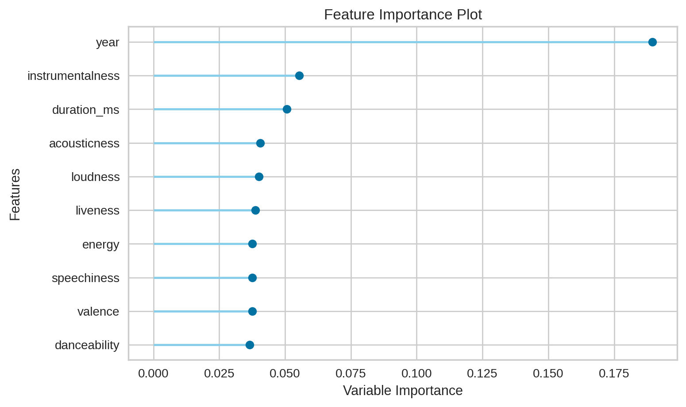
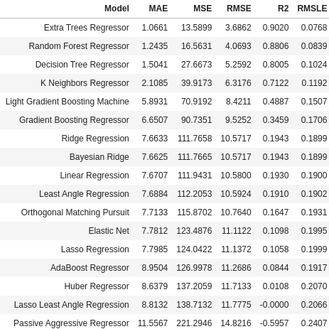

# **The Popularity Serum**

# **Predicting Popularity of Songs on Spotify using PyCaret**
## **Gary Monk**

[realatlas2022@gmail.com]() <br>
[GitHub](https://github.com/ATLas278)
<br>
[LinkedIn](https://www.linkedin.com/in/gary-monk-a58599164/)

# **Introduction**
As a musical enthusiast and music producer, I've always found great curiosity of why humans find certain elements in songs so appealing, from the structure of production, the rollercoaster of emotions illustrated, even down to the evaluated metrics of attributes in commercialized music. What makes it that the whole entire world stops in its tracks to binge play a number one hit? Inspired, it let me to want to find the relationship between song attributes and their popularity ratings in Spotify, and further predict popularity based on those selected attributes.

# **Technology Used**
* *Pandas*
* *NumPy*
* *Pickle*
* *Statsmodels*
* *Matplotlib*
* *Seaborn*
* *Shap*
* *PyCaret*

# **Dataset**
The dataset contains a vast collection of 19m+ songs in 175 countries from the Spotify API, provided by a Kaggle user, with publishing spanning from 1920 to 2021. We'll put focus on a subset of the data that spans from 2000 to 2021, narrowing it down to roughly 2 million songs, and keeping our spotlight on modernity. Each row represents a song and its attributes. 

<br>

Our target is **popularity**, an extremely important value that Spotify uses internally to rank all tracks on a scale from 0 to 100.

<br>

Our features contain attributes such as **explicit** or **clean**, **energy**, **percentage of instrumentals**, **percentage of vocals**, etc. 

# **Data Cleaning**
Through python's **Pycaret** library, I initialized a **setup()** method, which is a low-code method to identify your target, define your training and testing split, initialize normalization, yeo-johnson transformation to improve normality, and removing outliers and multicollinearity. I also ignored features that by pure common sense will have no effect on a song's popularity, such as **id**, **name**, **artists**, and **id_artists**

```python
reg1 = setup(data=pop_spotify_samp, target='popularity', train_size=0.80,
            ignore_features=['id','name','artists','id_artists'],
            normalize=True,
            transformation=True, transformation_method='yeo-johnson',
            transform_target=True,
            remove_outliers=True,
            remove_multicollinearity=True,
            log_experiment=True,experiment_name='spotify popularity')
            
```
# **EDA**
I read in my pickled subset file of the Spotify dataset, which I reduced the spanning publishing dates from 2000 to 2021 to prioritize modernity, and I also sorted popularity in ascending order from **30** to **100** like in the example below.
<br>

### Example of the Sorted Structure
|**POPULARITY** |artists|name|Danceability |Energy |Instrumentalness |Speechiness |Explicit |Mode |
|:--------------|:-------|:----|:------------:|:------:|:----------------:|:-----------:|:--------:|:----:|
|         **30**| ['Robin Trower']|Farther on up the Road - 2012 Remaster| 0.469|  0.918|         0.000392|      0.1730|        0|    1|
|         **30**| ['Armin van Buuren']|A State Of Trance (ASOT 996) - Tune Of The Yea...| 0.397|  0.638|         0.000000|      0.1760|        0|    1|
|         **30**| ['Above & Beyond', 'Zoë Johnston']|Reverie - Above & Beyond Club Mix| 0.453|  0.756|         0.064800|      0.0472|        0|    1|
|...            |...    |    |...      |...    |...              |...         |...      |...  |
|         **95**| ['KAROL G']|BICHOTA	| 0.863|  0.666|         0.000493|      0.1520|        1|    0|
|         **96**| ['Ariana Grande']|positions	| 0.737|  0.802|         0.000000|      0.0878|        1|    1|
|         **96**| ['24kGoldn', 'iann dior'] |Mood (feat. iann dior)| 0.700|  0.722|         0.000000|      0.0369|        1|    0|


<br>


In my previous project, I manually discovered correlation between features and popularity, such as...

<br>


<br>

But since we have a low-code library such as PyCaret, we'll use it to visualize feature importance in a short amount of time. Out of the 22 features, it defined 10 features as the most important in regards to affecting popularity rating.


# **Compare Models**
Using PyCaret, I ran 17 regression models to compare and contrast. PyCaret ranks the models in order from best performing, to the worse performing model.
<br>

As you can see below, **Extra Trees Regression** came out on top.



# **Extra Trees Regression**
**Extra Trees** is similar to **Random Forests**, but here are the key differences, and the reasoning why Extra Trees is performing better than Random Forest: <br>

* While **Random Forest uses bootstrap replicas** to subset the input data with replacement, **Extra Trees uses the whole original sample by default**.
* **Random Forest chooses the optimum split** when splitting nodes.
* **Extra Trees chooses it randomly**. However, once the split points are selected, the two algorithms choose the best one between all the subset of features. So while it's still randomized it's also optimized.

<br>

Extra Trees makes it easier to manage bias-variance tradeoff, using the whole original sample instead of a bootstrap replica to reduce bias, and choosing randomly the split point of each node to reduce variance.

<br>
When I trained the model, it output the average of each regression error metric highlighted in yellow.


# Prediction


As you can see in our predicitons on the whole dataset, we receive pretty accurate results due to our R-Squared showing 90%. There will be 10% of the results that will be mildy to moderately innacurate, and I'll work in the future to tune my hyperparameters to increase my R-Squared evaluation to decrease error